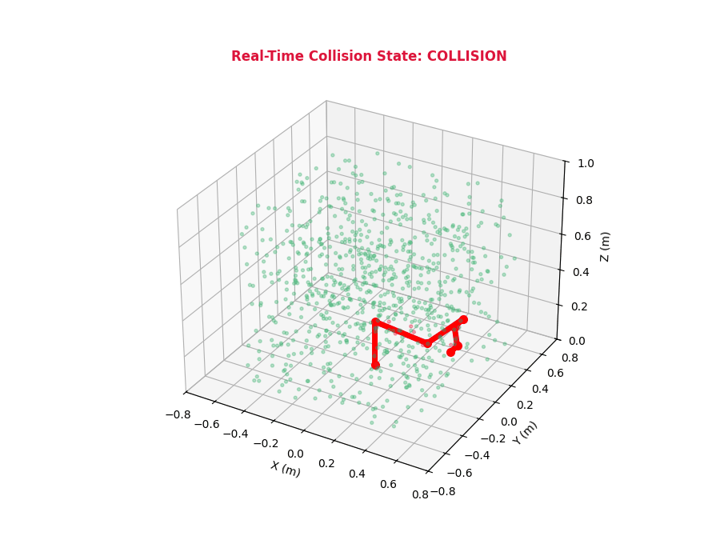

# ⚡ GPU-Accelerated 3D Robotic Collision Engine (CUDA & C++)

A high-performance real-time 3D collision detection and batch trajectory evaluation engine for multi-axis robotic manipulators operating in dense obstacle environments. Designed for high-frequency motion planning pipelines on NVIDIA GPUs.



---

## 🚀 Key Highlights & Benchmarks

* **Throughput:** Over **$10\times 10^9$ pairwise capsule-voxel tests/second** on an NVIDIA Tesla T4.
* **Batch Trajectory Verification:** Evaluates **$2,000$ 6-DOF trajectory waypoints** against **$100,000$ active obstacle voxels** in **$\approx 1.25\text{ ms}$** total ($< 0.65\text{ }\mu\text{s}$ per pose).
* **Device-Side Kinematics:** Full Denavit-Hartenberg (DH) forward kinematics computed directly inside GPU registers, eliminating Host-to-Device memory bottlenecks during trajectory optimization loops.
* **Zero Square-Root Overhead:** Collision predicates are strictly evaluated using squared Euclidean distances to maximize compute throughput.

### Performance Comparison

| Benchmark Scenario | CPU Sequential (Intel Xeon @ 2.2GHz) | CUDA GPU Engine (Tesla T4) | Speedup |
| :--- | :--- | :--- | :--- |
| **Single Pose Clearance** ($1,000,000$ voxels) | $\approx 24.50\text{ ms}$ | **$0.11\text{ ms}$** | **$222\times$** |
| **Batch Trajectory** ($2,000$ poses $\times$ $100,000$ voxels) | $\approx 4,800.00\text{ ms}$ | **$1.25\text{ ms}$** | **$3840\times$** |

---

## 📐 Mathematical Formulation

### 1. Device-Side Forward Kinematics (Denavit-Hartenberg)
The spatial transform matrix $T_i^{i-1} \in \mathrm{SE}(3)$ relating link frame $i$ to frame $i-1$ is defined using standard DH parameters (joint angle $\theta_i$, link offset $d_i$, link length $a_i$, and link twist $\alpha_i$):

```math
T_i^{i-1} = \begin{bmatrix}
\cos\theta_i & -\sin\theta_i \cos\alpha_i & \sin\theta_i \sin\alpha_i & a_i \cos\theta_i \\
\sin\theta_i & \cos\theta_i \cos\alpha_i & -\cos\theta_i \sin\alpha_i & a_i \sin\theta_i \\
0 & \sin\alpha_i & \cos\alpha_i & d_i \\
0 & 0 & 0 & 1
\end{bmatrix}
